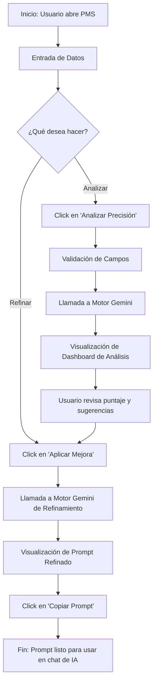
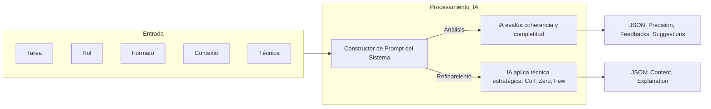
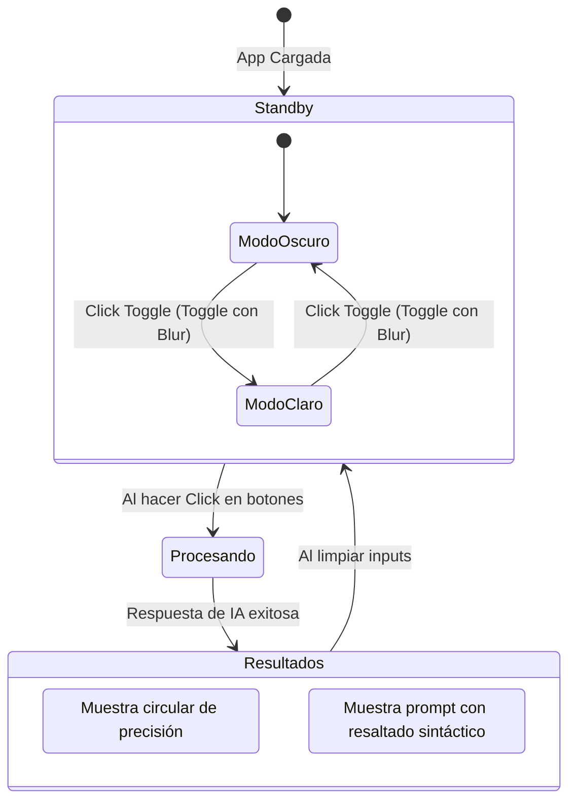

# Flujo de Procesos: PROMT MASTER SENA PMS

Este documento describe la arquitectura lógica y el flujo de datos de la aplicación mediante diagramas de flujo.

---

## 1. Flujo de Experiencia del Usuario (UX)

Describe el camino que sigue el usuario desde que abre la aplicación hasta que obtiene su prompt refinado.

---

## 2. Flujo de Procesamiento del Motor de IA (Backend-Logic)

Detalla cómo se estructuran las peticiones hacia el modelo **Gemini 3-Flash**.

---

## 3. Estados de la Interfaz de Usuario (UI States)

Muestra cómo cambia la pantalla según la interacción del usuario y el tema seleccionado.

---

## 4. Descripción de Componentes Clave

| Componente | Función |
| :--- | :--- |
| **Input Handler** | Captura Tarea, Rol, Formato y Contexto. |
| **Technique Selector** | Permite alternar entre arquitecturas de prompting. |
| **Gemini Service** | Módulo de comunicación con el modelo `gemini-3-flash-preview`. |
| **Animation Engine** | Controla las transiciones de `motion` (blur, fade, scale). |
| **Clipboard Sync** | Gestiona el copiado de texto al portapapeles del sistema. |

---
*Documento generado por el Sistema de Meta-Ingeniería v2.4*
